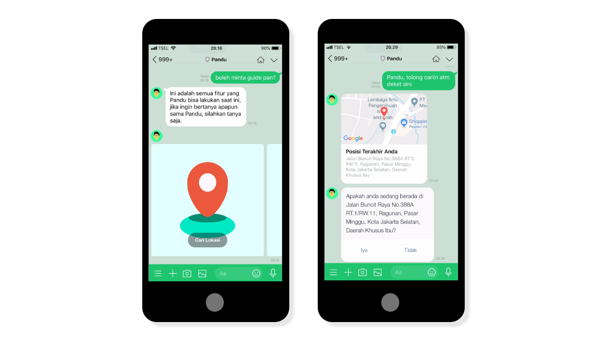
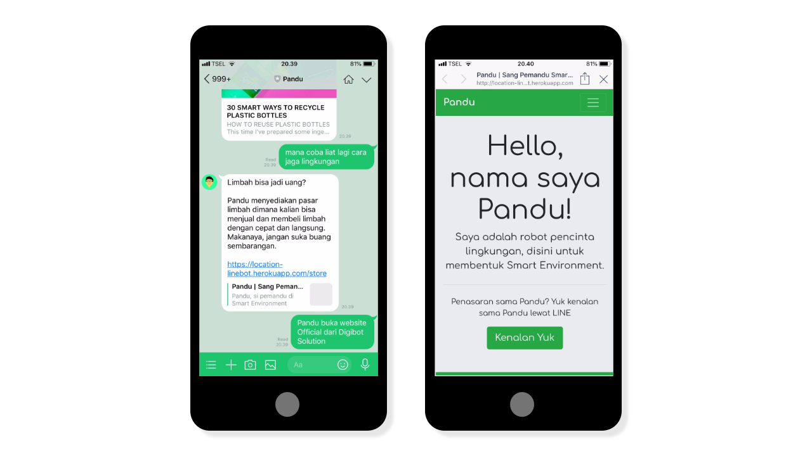

# Pandu Chatbot

> "An environmental lover chatbot, here to form the Smart Environment of today."

## About

Pandu is a Chatbot designed to help people acknowledge the environment around them better in hopes of increasing the care towards the environment.

It was created for a Competition from COMPFEST X Chatbot Invasion. Although it didn't won the competition, it still a really useful bot to play around.

A quick warning of detected spaghetti codes and bad practices, I try to improve it in the future but I also do accept pull requests from people around.

## Feature

#### Location Finder

Pandu can search restaurants, cinemas, minimarkets and other places quickly and accurately. Pandu uses the Google Maps and Zomato APIs to process data.

#### Weather Man

Pandu will remind you today's weather so you go safely and comfortably. Pandu uses the OpenWeatherMap API to process data.

#### Waste Market

Pandu creates an Online Market where users can buy and sell waste. Making a good business opportunity for its users also cleans around us.

#### Travel Point and Tokens

Pandu has a token system, to redeem a token you must first travel somewhere that supports the Pandu Chatbot. Once the token is redeemed, you can get points, these points can be exchange for a coupon or voucher of your choice.

#### Environment Tips and Tricks

Pandu occasionally send users Environment Tips and Tricks, you can even ask Pandu for it if you are curious.

#### Website

Pandu has a website. Check the official website is at [pandubot.com](http://location-linebot.herokuapp.com)

## Tech Stack

The Application is running on Python Flask and Deploying it on Heroku. The Database uses PostgreSQL. Install the requirements.txt beforehand.

## Team

- Abhishta Gatya - Fullstack Developer

- Fadhi Rakhman - Marketing & Presentation Designer

- Kevin Govinda - Business Development

## License

This project is licensed under the MIT License - see the [LICENSE](https://github.com/abhishtagatya/pandubot/blob/master/LICENSE) for details
